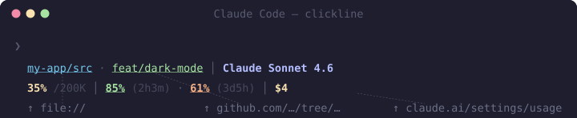

# clickline

Compact, clickable, customizable statusline for [Claude Code](https://claude.ai/code). Every element that can be a link is one — Cmd+click your working directory, git branch, PR, or quota directly from the statusline.



## Features

- **OSC-8 hyperlinks** — path opens in Finder/editor, branch opens on GitHub, quota opens claude.ai, cost opens your session transcript
- **Configurable layout** — split elements across one or two lines, reorder freely, toggle each on/off
- **10 color themes** — Catppuccin, Dracula, Tokyo Night, Gruvbox, Nord, Solarized, One Dark, Rosé Pine
- **Custom items** — add your own shell-driven statusline segments with caching and conditional display
- **Per-repo items** — `.clickline` file for repo-local service links (Railway, Vercel, Supabase, etc.), shareable via git
- **Interactive configurator** — TUI (Textual) or bash wizard to choose elements, theme, and layout
- **Smart truncation** — long paths show last 2 segments, branch names cap at 25 chars
- **PR + CI** — open PR number (clickable), "New PR" shortcut, CI status ✓ ✗ ⋯ (all async, never blocks)
- **Quota tracking** — 5-hour and 7-day usage with time-until-reset, cached and stale-while-revalidated
- **Context window** — percentage + max size, with warnings at 60% and 80%
- **Dirty indicator** — ·N shows count of modified/staged files after branch name

## Requirements

- [Ghostty](https://ghostty.org) — OSC-8 and 24-bit color support required (iTerm2, WezTerm also work)
- [Claude Code](https://claude.ai/code)
- `jq`, `git`, `curl`
- macOS (uses BSD `date` and `security` keychain for OAuth token)
- `gh` CLI — optional, needed for PR and CI features
- `python3` + `textual` — optional, for the graphical configurator (`pip install textual`); falls back to a text wizard

## Installation

```sh
curl -fsSL https://raw.githubusercontent.com/gradigit/clickline/main/install.sh | bash
```

The installer will:
1. Check dependencies
2. Let you choose which elements to show (fzf multi-select or numbered menu)
3. Choose where Cmd+click on the path opens (Finder, VS Code, Cursor, or nothing)
4. Pick a color theme
5. Write `~/.claude/clickline.conf` with your settings
6. Copy `statusline.sh` to `~/.claude/statusline.sh`
7. Update `~/.claude/settings.json`

### Reconfigure

Run the installer again at any time to change settings. Changes take effect on the next Claude Code response — no restart needed.

```sh
bash ~/.claude/statusline-install.sh
# or, if you cloned the repo:
bash install.sh
```

### Manual install

```sh
curl -o ~/.claude/statusline.sh https://raw.githubusercontent.com/gradigit/clickline/main/statusline.sh
chmod +x ~/.claude/statusline.sh
cp clickline.conf.default ~/.claude/clickline.conf
```

Then add to `~/.claude/settings.json`:

```json
{
  "statusLine": {
    "type": "command",
    "command": "/bin/bash /Users/YOU/.claude/statusline.sh",
    "timeout": 5000
  }
}
```

## Configurator

The TUI configurator gives you a live preview, drag-and-drop layout editing, theme switcher, and preset selector:

```sh
python3 ~/.claude/clickline-configure.py
```

Requires `pip install textual`. Falls back to the bash wizard if Textual is not installed.

### TUI hotkeys

| Key | Action |
|---|---|
| `s` | Save config and exit |
| `q` / `Escape` | Quit without saving |
| `Tab` | Switch between Layout and Elements panes |
| `↑` `↓` | Navigate items |
| `Shift+↑` `Shift+↓` | Reorder items in layout |
| `n` | Insert line break |
| `d` | Delete item from layout |
| `Space` | Toggle element on/off (in Elements pane) |
| `o` | Open options panel |
| `t` | Switch color theme |
| `c` | Add custom element |
| `r` | Add repo item (.clickline) |

## What's clickable

| Element | Destination |
|---|---|
| Working directory | `file://` — opens in Finder / VS Code / Cursor |
| Git branch | `https://github.com/owner/repo/tree/branch` |
| PR `#N` | Pull request page |
| `New PR` | GitHub compare page to open a PR |
| CI symbol (✓ ✗ ⋯) | GitHub Actions run page |
| 5h quota % | `https://claude.ai/settings/usage` |
| 7d quota % | `https://claude.ai/settings/usage` |
| `Quota —` (unavailable) | `https://claude.ai/settings/usage` |
| Commit hash | `https://github.com/owner/repo/commit/SHA` |
| Model name | `https://docs.anthropic.com/en/docs/about-claude/models/overview` |
| Version | `https://github.com/anthropics/claude-code/releases` |
| Session cost | `file://` — opens session transcript (JSONL) |

OSC-8 links require a terminal that supports them. Ghostty, iTerm2, and WezTerm all do. Cmd+click (macOS) activates the link.

## Layout

```
my-app/src · feat/dark-mode·3 ↑2 │ #42 │ ✓ │ Claude Sonnet 4.6
35%/200K │ 85% (2h3m) · 61% (3d5h) │ $4
```

**Line 1:** `path [· branch [·dirty] [↑N ↓N]] [│ commit] [│ PR] [│ CI] [│ model [thinking]] [│ version] [│ VIM] [│ agent]`

**Line 2:** `ctx%/maxK [warn] │ 5h% (reset) · 7d% (reset) │ $cost`

## Themes

Set `THEME=name` in `~/.claude/clickline.conf` or use the configurator (press `t`).

| Theme | Style |
|---|---|
| `catppuccin-mocha` | Pastel dark (default) |
| `catppuccin-frappe` | Pastel mid-tone |
| `catppuccin-latte` | Pastel light |
| `dracula` | High contrast dark |
| `tokyo-night` | Cool blue dark |
| `gruvbox-dark` | Warm retro dark |
| `nord` | Arctic blue dark |
| `solarized-dark` | Classic low-contrast |
| `one-dark` | Atom-inspired dark |
| `rose-pine` | Soft elegant dark |

Each theme provides 10 semantic color slots (label, sep, dim, sapphire, lavender, mauve, gold, green, peach, red) mapped to the theme's palette. Unknown theme names fall back to `catppuccin-mocha`.

## Custom items

Add your own statusline elements — service links, status indicators, or static labels.

**Global items** are stored in `~/.claude/clickline-custom.json` and appear in every repo.

**Per-repo items** are stored in `.clickline` at the repo root and only appear in that repo. Repo items override global items with the same name. You can commit `.clickline` to share service links with your team (add it to `.gitignore` if URLs are sensitive).

Use the `/clickline-custom` skill for interactive setup, or the TUI configurator (`c` for global, `r` for repo item).

Both files use the same JSON format:

```json
{
  "clock": {
    "cmd": "date +%H:%M",
    "color": "lavender",
    "label": "clock",
    "cache_ttl": 30
  }
}
```

Then add `custom_clock` to your `LAYOUT` in `clickline.conf`:

```
LAYOUT=path branch pr custom_clock | context quota cost
```

### Custom item fields

| Field | Required | Description |
|---|---|---|
| `label` | Yes | Static label (used as display text when `cmd` is empty) |
| `cmd` | No | Shell command whose stdout becomes the displayed text |
| `color` | No | Palette key: `sapphire` `lavender` `mauve` `gold` `green` `peach` `red` `dim` |
| `link` | No | OSC-8 URL — supports `{dir}` and `{branch}` placeholders |
| `cache_ttl` | No | Seconds to cache `cmd` output (default: 30) |
| `condition` | No | Shell command that must exit 0 for the item to appear |

Adjacent custom items render with dot separators (` · `) instead of pipe separators (` │ `).

### Sample custom items

**Kubernetes context:**
```json
{
  "kube": {
    "cmd": "kubectl config current-context 2>/dev/null | sed 's/.*_//'",
    "color": "sapphire",
    "label": "⎈ k8s",
    "condition": "command -v kubectl >/dev/null 2>&1"
  }
}
```

**Battery percentage (macOS):**
```json
{
  "battery": {
    "cmd": "pmset -g batt | grep -o '[0-9]*%' | head -1",
    "color": "green",
    "label": "🔋",
    "cache_ttl": 60
  }
}
```

**Docker running containers:**
```json
{
  "docker": {
    "cmd": "docker ps -q 2>/dev/null | wc -l | tr -d ' '",
    "color": "sapphire",
    "label": "🐳 0",
    "condition": "docker info >/dev/null 2>&1",
    "cache_ttl": 15
  }
}
```

**Node.js version:**
```json
{
  "node": {
    "cmd": "node -v 2>/dev/null",
    "color": "green",
    "label": "node",
    "condition": "command -v node >/dev/null 2>&1",
    "cache_ttl": 120
  }
}
```

**Pseudo-animated spinner:**

The statusline runs fresh on each poll — there is no persistent process. You can create a pseudo-animation using epoch modular arithmetic with `cache_ttl: 1`:

```json
{
  "spinner": {
    "cmd": "printf '%s' '⠋⠙⠹⠸⠼⠴⠦⠧⠇⠏' | fold -w3 | sed -n \"$(($(date +%s) % 10 + 1))p\"",
    "color": "lavender",
    "label": "spin",
    "cache_ttl": 1
  }
}
```

The spinner character changes each second because `date +%s` modulo 10 selects a different frame. Any `cache_ttl: 1` item re-evaluates every poll cycle.

## Config reference

`~/.claude/clickline.conf` (created by installer, or copy from `clickline.conf.default`):

```bash
# Features (true/false)
SHOW_BRANCH=true
SHOW_DIRTY=true          # ·N modified/staged files after branch
SHOW_AHEAD_BEHIND=false  # ↑N ↓N commits ahead/behind remote
SHOW_COMMIT=false        # HEAD short hash → GitHub commit
SHOW_PR=true             # #N or "New PR" (requires gh)
SHOW_CI=false            # ✓ ✗ ⋯ GitHub Actions (requires gh)
SHOW_MODEL=true
SHOW_VERSION=false       # Claude Code version
SHOW_CONTEXT=true
SHOW_QUOTA=true
SHOW_COST=true

# Theme
THEME=catppuccin-mocha   # see Themes section for full list

# Options
BRANCH_MAX_CHARS=25      # truncate long branch names
PATH_SEGMENTS=2          # show last N path segments
PATH_LINK_TARGET=finder  # finder | vscode | cursor | none
PR_CACHE_TTL=60          # seconds between PR cache refreshes
CI_CACHE_TTL=30          # seconds between CI cache refreshes
QUOTA_CACHE_TTL=60       # seconds between quota cache refreshes
```

Colors follow the same green → yellow → red progression for context, 5h quota, and 7d quota (< 50% green, < 75% yellow, ≥ 75% red). Cost is ceiling-rounded to whole dollars.

## Quota troubleshooting

If quota shows `—`, run:

```sh
bash install.sh --quota
```

This walks through all steps (keychain entry, token extraction, API call) and shows a specific fix message for each failure mode. The most common fix is:

```
/logout
/login
```

in Claude Code to refresh OAuth token scopes.

## PR and CI features

PR and CI data is fetched via the `gh` CLI. Install and authenticate:

```sh
brew install gh
gh auth login
```

Both use a stale-while-revalidate cache — they never block the statusline render. Data appears on the next response after the cache warms (typically 1 response delay on first use for a branch).

PR segment is hidden on the default branch (main/master) since PRs don't apply there.

## License

MIT
